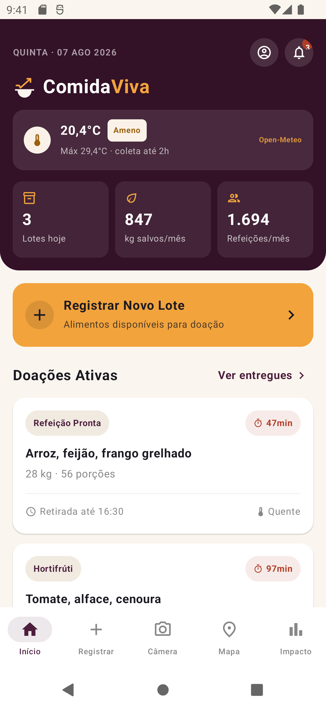
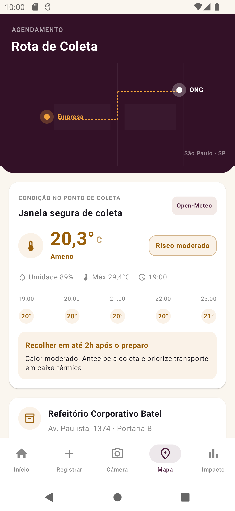
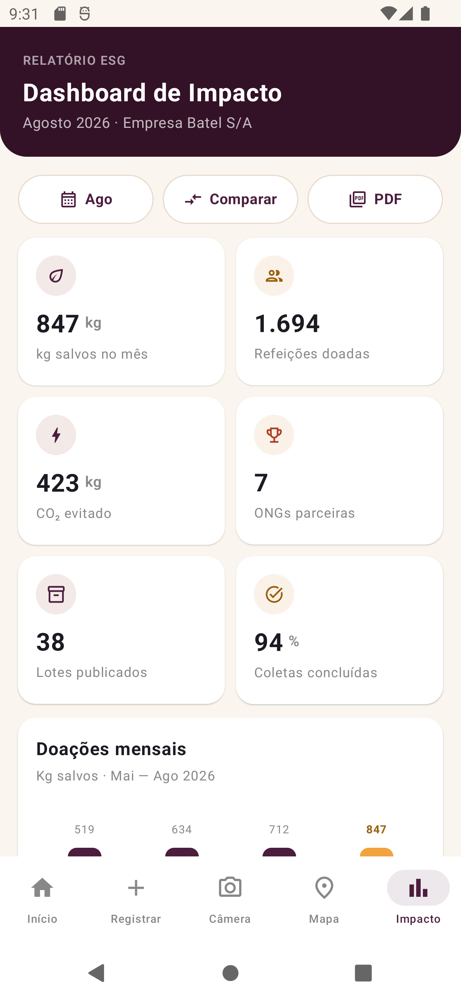
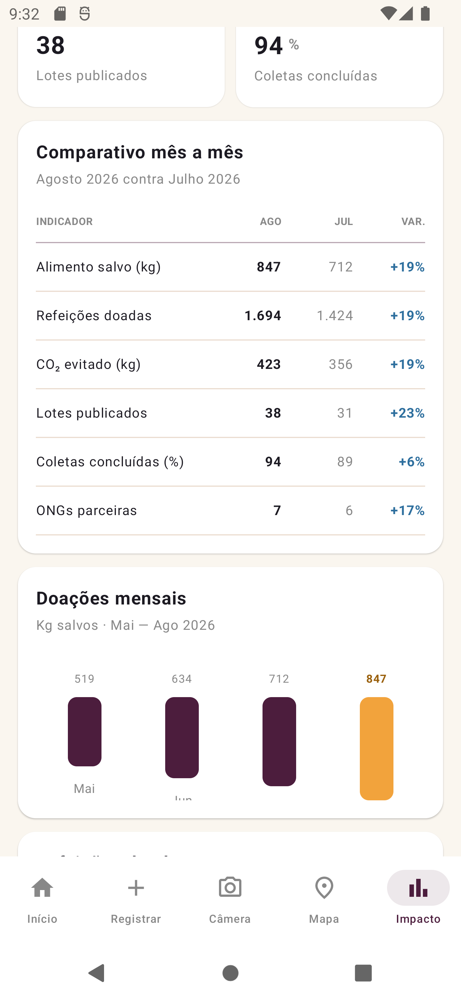
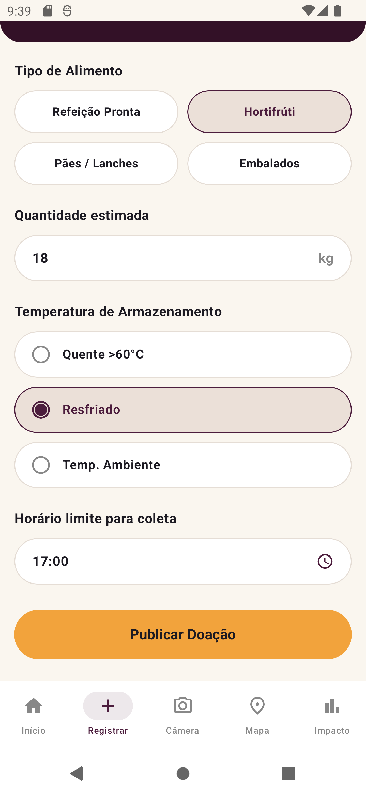
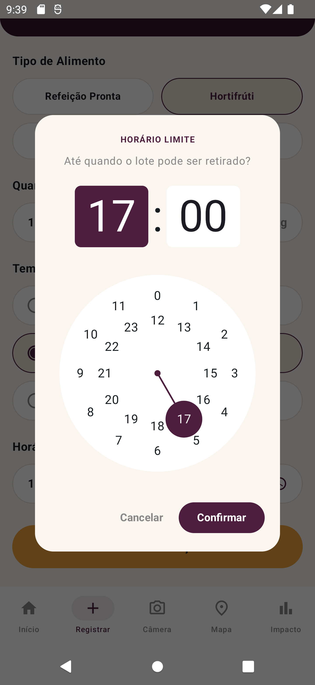
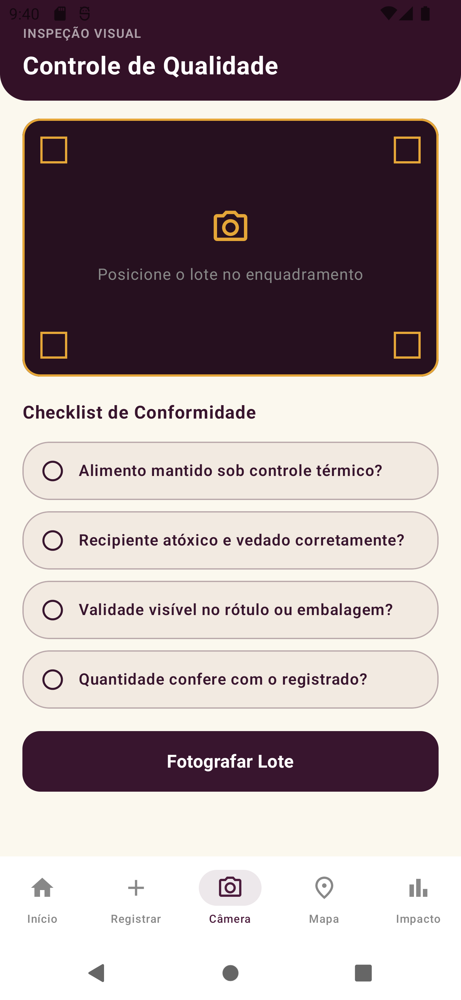
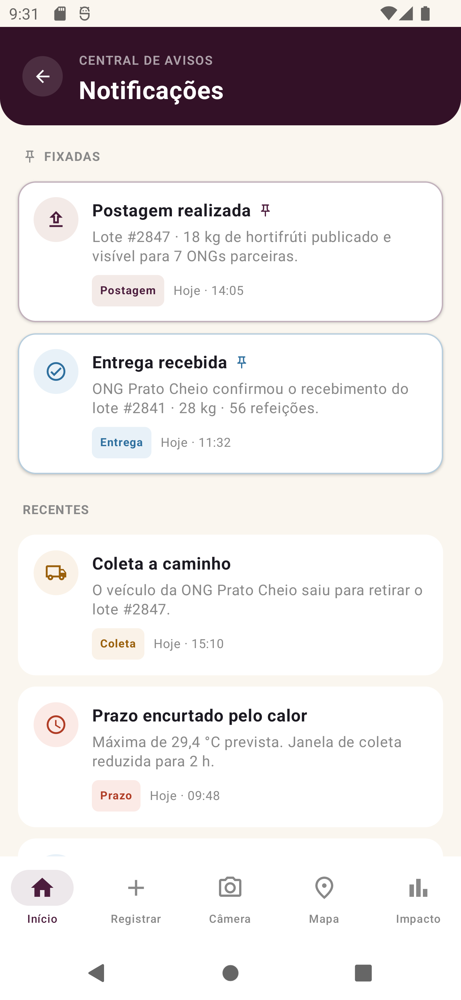
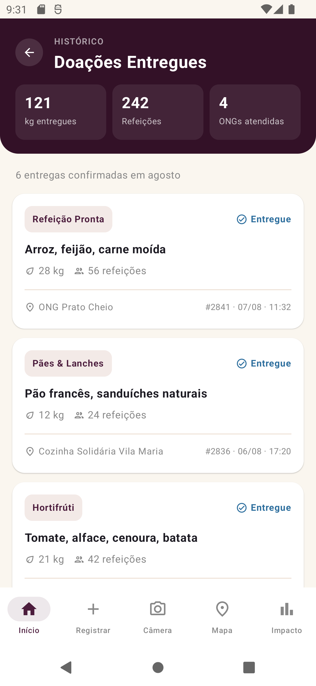
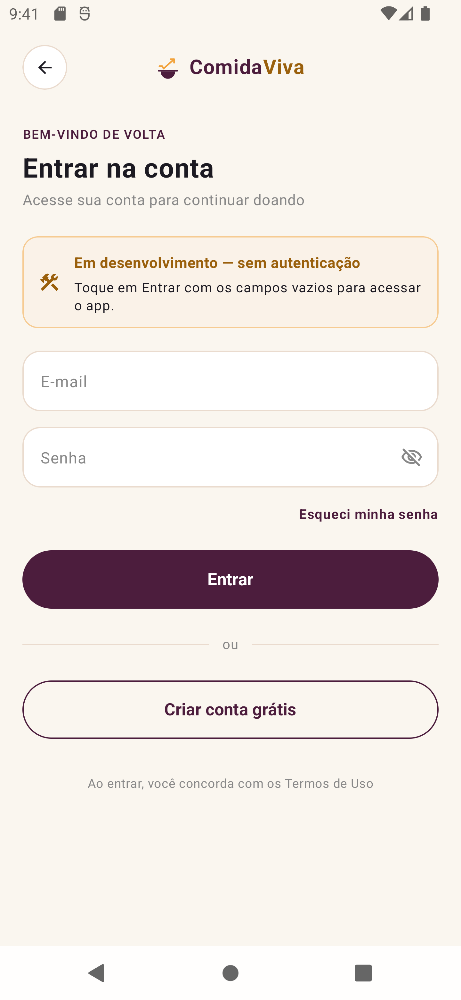

<div align="center">


# ComidaViva

**Conectando quem tem comida com quem precisa dela**

Aplicativo Android nativo que transforma excedente alimentar corporativo em refeições —
e mede o impacto ESG disso.


</div>

---

## Sobre

Refeitórios corporativos, restaurantes e supermercados descartam alimento em bom estado
todos os dias. ONGs e cozinhas comunitárias precisam desse alimento. O que falta entre os
dois é **coordenação dentro da janela de tempo em que a comida ainda é segura**.

O ComidaViva cobre esse ciclo:

```
Registrar excedente  →  Validar qualidade  →  Agendar coleta  →  Medir impacto
```

O diferencial não é apenas intermediar a doação, mas **quantificar** o que ela evitou e
devolver esse número à empresa como relatório ESG exportável em PDF.

## Impacto ESG

| Pilar | Como o app atua |
|---|---|
| 🌱 **Ambiental** | Cada quilo desviado do aterro deixa de gerar metano. O app converte quilos doados em CO₂ equivalente evitado e usa previsão do tempo real para reduzir perdas por quebra da cadeia térmica. |
| 🤝 **Social** | Converte excedente em refeições para ONGs parceiras. O cadastro tem perfil dedicado para ONGs, sem custo. |
| 📋 **Governança** | Trilha auditável por lote: inspeção visual, checklist de conformidade, QR Code de entrega, central de avisos e relatório mensal em PDF. Alinhado à **Lei nº 14.016/2020** e aos **ODS 2 e 12** da ONU. |

---

## Telas

<table>
  <tr>
    <td align="center" width="25%">
      <br>
      <sub><b>Home</b><br>KPIs e condição térmica ao vivo</sub>
    </td>
    <td align="center" width="25%">
      <br>
      <sub><b>Agendamento</b><br>Janela de coleta calculada</sub>
    </td>
    <td align="center" width="25%">
      <br>
      <sub><b>Dashboard ESG</b><br>Filtro, comparativo e PDF</sub>
    </td>
    <td align="center" width="25%">
      <br>
      <sub><b>Comparativo</b><br>Variação mês a mês</sub>
    </td>
  </tr>
  <tr>
    <td align="center">
      <br>
      <sub><b>Registrar excedente</b></sub>
    </td>
    <td align="center">
      <br>
      <sub><b>Horário limite</b></sub>
    </td>
    <td align="center">
      <br>
      <sub><b>Controle de qualidade</b></sub>
    </td>
    <td align="center">
      <br>
      <sub><b>Notificações</b></sub>
    </td>
  </tr>
  <tr>
    <td align="center">
      <br>
      <sub><b>Doações entregues</b></sub>
    </td>
    <td align="center">
      <br>
      <sub><b>Login</b> (protótipo)</sub>
    </td>
    <td colspan="2"></td>
  </tr>
</table>

---

## Funcionalidades

- **12 telas** navegáveis com Navigation Compose
- **Previsão do tempo real** no ponto de coleta, consumida do Open-Meteo
- **Janela de coleta calculada** a partir da temperatura máxima prevista
- **Faixas térmicas coloridas** — frio, ameno e quente
- **Cache offline** da última previsão em `SharedPreferences`
- **Central de notificações** com avisos fixos de postagem e entrega
- **Histórico de entregas** com totais calculados da lista
- **Dashboard ESG** com filtro de mês, comparativo e 6 indicadores
- **Exportação em PDF** do relatório mensal, com compartilhamento nativo
- **Tema claro e escuro** completos, com paleta própria

---

## Serviço consumido

```
https://api.open-meteo.com/v1/forecast
```

API pública e gratuita — **sem chave de acesso, sem cadastro, sem back-end próprio**.

```http
GET /v1/forecast
    ?latitude=-23.5613&longitude=-46.6565
    &current=temperature_2m,relative_humidity_2m
    &hourly=temperature_2m
    &daily=temperature_2m_max
    &timezone=America%2FSao_Paulo&forecast_days=1
```

### Por que previsão do tempo em um app de doação

Alimento excedente tem uma janela de segurança que **encurta conforme a temperatura sobe**.
Sem dado externo, o app só poderia exibir um prazo fixo. Com a previsão real do endereço da
coleta, ele recomenda uma janela calculada:

| Máxima prevista | Risco | Janela segura | Recomendação |
|---|---|---|---|
| `< 25 °C` | Baixo | até 4 h | Janela padrão mantida |
| `25 – 29,9 °C` | Moderado | até 2 h | Antecipar coleta, usar caixa térmica |
| `≥ 30 °C` | Alto | até 1 h | Coleta urgente, refrigeração ativa na rota |

Se a requisição falhar, o app exibe a última leitura salva no aparelho em vez de quebrar.

---

## Tecnologias

| Camada | Escolha |
|---|---|
| Linguagem | Kotlin 2.2.10 |
| UI | Jetpack Compose · Material 3 (BOM 2026.02.01) |
| Navegação | Navigation Compose 2.9.0 |
| Rede | `HttpURLConnection` — Android SDK |
| JSON | `org.json.JSONObject` — Android SDK |
| PDF | `android.graphics.pdf.PdfDocument` — Android SDK |
| Compartilhamento | `FileProvider` — AndroidX Core |
| Persistência | `SharedPreferences` |
| Build | Gradle 9.5 · AGP 9.3.2 · JDK 25 |

> **Nenhuma biblioteca de terceiros foi adicionada.** Rede, parsing de JSON e geração de
> PDF usam apenas classes que já acompanham o Android SDK — sem Retrofit, OkHttp, Gson,
> iText ou PdfBox. As únicas dependências são AndroidX/Compose e os ícones do Material.

---

## Estrutura

```
app/src/main/java/br/com/fiap/comidaviva/
├── MainActivity.kt              Activity única: tema + NavHost
├── navigation/                  Rotas e navegação da barra inferior
├── screens/                     Uma tela por arquivo (12)
├── components/                  Marca, barra inferior e card de previsão
├── service/                     Open-Meteo, dados de impacto e geração de PDF
└── ui/theme/                    Paleta, tema claro/escuro e tipografia
```

Cerca de **6.900 linhas de Kotlin** em 25 arquivos.

---

## Como executar

**Pré-requisitos:** Android Studio com JDK 25 e Android SDK com `compileSdk 37`.

```bash
git clone <url-do-repositorio>
cd comidaviva
./gradlew installDebug
```

Ou abra a pasta no Android Studio e rode com `Shift + F10`.

O app abre direto na Home — **não há barreira de login**. As telas de abertura, login e
cadastro ficam acessíveis pelo ícone de conta no cabeçalho.

### Gerando o APK de release

```bash
./gradlew clean assembleRelease
```

Saída em `app/build/outputs/apk/release/app-release.apk` (**2,6 MB**).

O keystore `comidaviva.jks` acompanha o repositório de propósito, para que qualquer pessoa
consiga recompilar o projeto — e por isso a senha está em texto puro no
`app/build.gradle.kts`. É uma chave descartável, criada só para esta entrega acadêmica:
**não use em produção nem para publicar na Play Store**.

> O R8 está ligado no build de release. Sem ele o APK sai com **45 MB**, porque a
> biblioteca `material-icons-extended` traz milhares de ícones. Com o R8 apenas os
> referenciados entram no pacote.

---

## Limitações conhecidas

Este é um MVP acadêmico. Os pontos abaixo são intencionais:

- **Sem back-end próprio** — a única fonte externa é o Open-Meteo; doações, ONGs e o
  histórico mensal são dados estáticos definidos no código
- **Autenticação não funcional** — login e cadastro são protótipos de interface, o que a
  própria tela declara em um aviso visível
- **Dados não trafegam entre telas** — cada tela mantém o próprio estado local
- **Câmera simulada** — a inspeção visual alterna um estado, sem acessar a câmera
- **Mapa ilustrativo** — a rota é desenhada com `Canvas`, sem geolocalização
- **Coordenadas fixas** — a previsão usa sempre o endereço do cenário, sem GPS

### Próximos passos naturais

1. Persistir os lotes registrados com **Room** e alimentar o Dashboard com dados reais
2. Substituir a captura simulada pela câmera do aparelho
3. Emitir notificações do sistema com `NotificationManager`
4. Autenticação real com um serviço BaaS
5. Geocodificar o endereço da coleta em vez de usar coordenadas fixas

---

## Documentação

A documentação técnica completa — arquitetura, detalhamento de cada tela, contrato da API
e decisões de projeto — está em **[DOCUMENTACAO.md](DOCUMENTACAO.md)**.

---

## Contexto

Projeto desenvolvido para a disciplina de Desenvolvimento Mobile do curso **2TDS — FIAP**,
com o tema *tecnologias aplicadas a ESG*.
